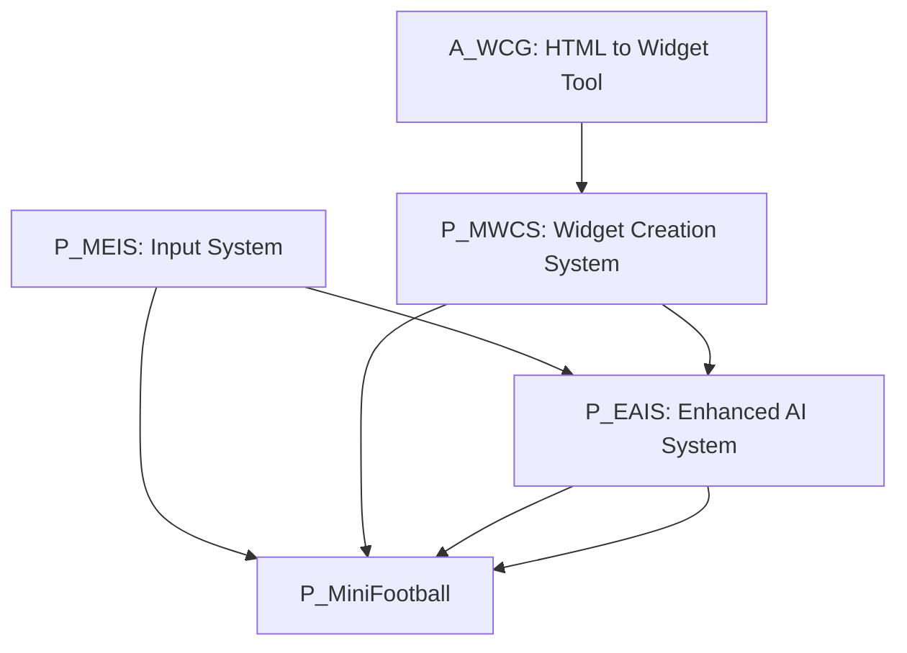

# Workflow Notes

This document captures the stable workflow, dependency graph, and build/test procedures for the Mini Football project and its modular plugins.

## 🏗️ Dependency Graph

The project is built on a modular architecture where gameplay is decoupled from input, UI, and AI logic.

- **P_MEIS**: Dynamic input binding and injection.
- **P_MWCS**: Deterministic Widget Blueprint generation from JSON specs.
- **P_EAIS**: JSON-programmable AI runtime and visual editor.
- **P_MiniFootball**: Core gameplay logic integrating all of the above.
- **A_WCG**: Standalone tool (inside P_MWCS) for converting web content to P_MWCS specs.

---

## 📦 Building Plugins

### Unreal Engine Plugins

All 4 plugins (`P_MEIS`, `P_MWCS`, `P_EAIS`, `P_MiniFootball`) are standard Unreal Engine plugins.

**Manual Build:**

- Compile the project in Visual Studio / Rider.
- Or use `RunUAT.bat BuildPlugin -Plugin="Path/To/Plugin.uplugin" -Package="Output/Path"`.

**Headless/CI Build:**

- See `Phase 1` for standardized scripts.

### A_WCG (Standalone Tool)

Located at `Plugins/P_MWCS/A_WCG/`.

- **System Requirements**: CMake 3.16+, MSVC (VS 2019+), C++17.
- **Build**: Run `.\DevTools\scripts\Build.ps1 -Configuration Release` from the `A_WCG` directory.

---

## 🛠️ Editor Tools & Workflows

### 1. Widget Generation (P_MWCS)

- **Workflow**: Modify C++ `GetWidgetSpec()` → Run `MWCS_CreateWidgets` commandlet.
- **Validation**: Run `MWCS_ValidateWidgets` commandlet.
- **HTML to UE**: Use `A_WCG` to convert HTML → C++/JSON specs → P_MWCS generation.

### 2. AI Authoring (P_EAIS)

- **Visual Editor**: Open via `Tools → EAIS → EAIS AI Editor`.
- **JSON Edit**: Modify `*.runtime.json` in `Content/AIProfiles/`.
- **Validation**: Use `.\DevTools\scripts\RunEAISTests.ps1` (in P_EAIS).

---

## 🤖 AI Runtime Execution

### Heartbeat (Tick)

- The AI runtime (`FAIInterpreter`) ticks exclusively on the **Server**.
- Decision interval is configurable per state (`tickIntervalMs`).

### Decision Logic (Gambit Table)

1. **Event Processing**: FIFO queue of events (triggered by gameplay).
2. **Tick Action**: Execute `onTick` actions for the current state.
3. **Transition Evaluation**: Priority-sorted check of conditions. First match wins.
4. **State Transition**: `onExit` (old state) → `onEnter` (new state).

### Integration Points

- **Sensors**: `AMF_PlayerCharacter::SyncBlackboard` populates the AI blackboard.
- **Actuators**: `UMF_EAISActionExecutorComponent` executes generic action IDs (e.g., `"MF.Shoot"`).
- **Targeting**: `IEAIS_TargetProvider` resolves world locations for named targets (e.g., `"Ball"`).

### Blackboard Keys (Sensors)

| Key                     | Type  | Description                                     |
| ----------------------- | ----- | ----------------------------------------------- |
| `HasBall`               | Bool  | True if this character possesses the ball       |
| `TeamHasBall`           | Bool  | True if a teammate has the ball                 |
| `OpponentHasBall`       | Bool  | True if an opponent has the ball                |
| `IsBallLoose`           | Bool  | True if no one possesses the ball               |
| `IsInDanger`            | Bool  | True if an opponent is within 200 units         |
| `HasClearShot`          | Bool  | True if no enemies are in the shot cone to goal |
| `DistToBall`            | Float | Distance to the ball                            |
| `DistToOpponentGoal`    | Float | Distance to opponent's goal                     |
| `DistToNearestOpponent` | Float | Distance to closest enemy                       |

### Game Actions

| Action ID   | Parameters               | Description                   |
| ----------- | ------------------------ | ----------------------------- |
| `MF.Shoot`  | `{"power": 0.0-1.0}`     | Shoot towards aimed direction |
| `MF.Pass`   | None                     | Pass ball forward             |
| `MF.Tackle` | None                     | Execute tackle animation      |
| `MF.Sprint` | `{"active": true/false}` | Toggle sprint mode            |
| `MF.Face`   | `{"target": "Ball"}`     | Rotate to face target         |
| `MF.Mark`   | None                     | Follow nearest opponent       |

### Available Targets

| Target Name       | Description          |
| ----------------- | -------------------- |
| `Ball`            | Ball actor/location  |
| `Goal_Opponent`   | Opponent's goal      |
| `Goal_Self`       | Own team's goal      |
| `BallCarrier`     | Player with ball     |
| `NearestOpponent` | Closest enemy player |

---

## ✅ Automation & Verification

### Code Verification

- `Verify_CodePatterns.ps1`: Ensures strict architectural boundaries (no P_MiniFootball refs in plugins).
- `Verify_ActionNameParity.ps1`: Checks that input actions match between P_MEIS and P_MiniFootball.

### Headless Tests

- `run_ue_tests.ps1`: Launches Unreal in commandlet mode and runs automated tests.
- `validate_profiles.py`: Deterministic validation of AI JSON profiles against schema.
